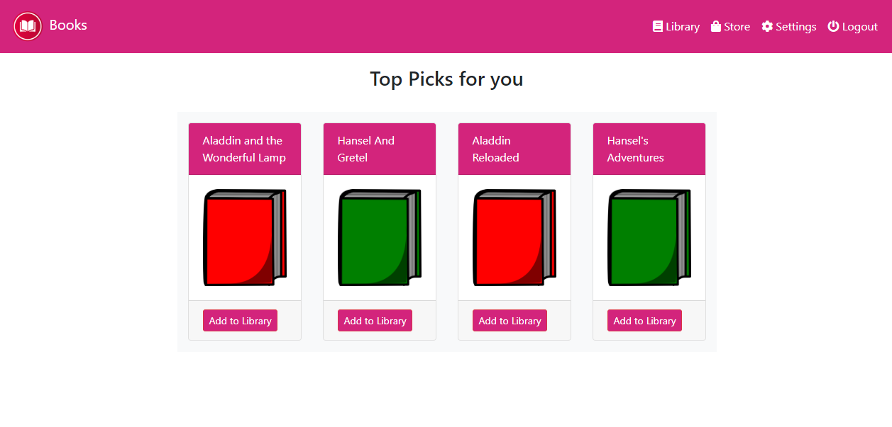
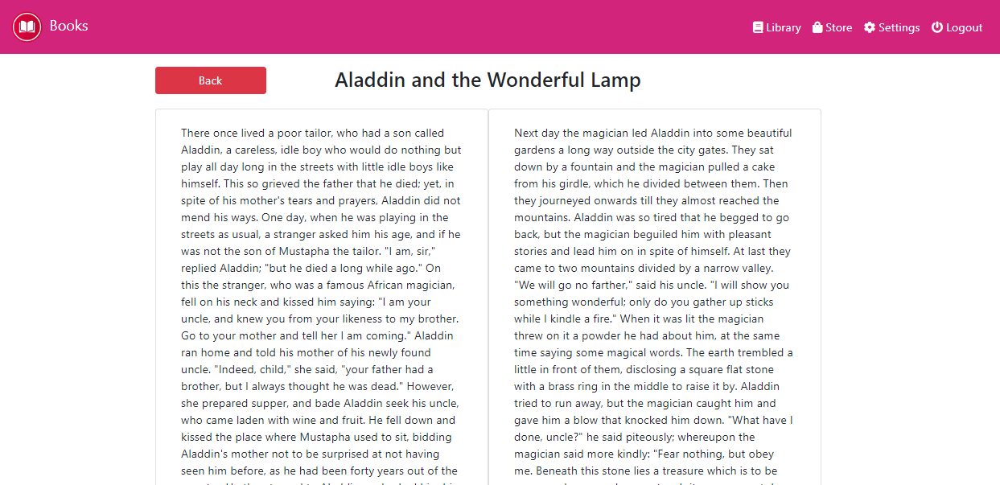

# ebooks

This project was generated with [Angular CLI](https://github.com/angular/angular-cli) version 9.1.6.

## Problem Statement

Create a web based simulation interface for an e-ink book reader like Amazon Kindle hardware device. It Should support:

 1. Addition and removal of books
 2. Reading interface
 3. Collections and library section
 4. Settings section

## Project Design

Since there is no backend involved, the backend parts are implemented as JSON files and localStorage in javascript.

 - On initial launch, there is a login screen
 - Enter the credentials "user" and "password" to login. The login is persisted till the browser session is open
 - The library page is shown by default. Initially the library is empty, there is a link to go to store
 - There are also links available in top navigation bar for the various pages including *settings* and *logout*
 - In the store, 2 entries are available which are read from a json file (in assets)
 - The entry can be added to library, and removed (from the library page)
 - In the library page, once entry is added, you can click on the book image to open a reader interface with pagination
 - The double/single page mode and background of the pages can be set using settings page. The settings are stored in browser local storage and hence is persistent on refreshes and across pages
 - Other controls are self explanatory.

## Running (dev server)

Install the following dependencies:
 - Install node js 10+
 - Install angular cli
    npm install -g @angular/cli
 - Copy this project directory to a location
 - Install dependencies, from the project folder
    npm install
 - Run `ng serve` for a dev server from this directory. Navigate to `http://localhost:4200/`. The app will automatically reload if you change any of the source files.

## Running (docker)

On a machine where docker is available:
 - Copy this project directory to a location
 - Run `docker build -t ebooks-project .` from the project directory
 - Run the image
     docker run -p 80:80 ebooks-project

## Demo

Live Demo: https://ebooks.avpcloud.in

Screenshot:

